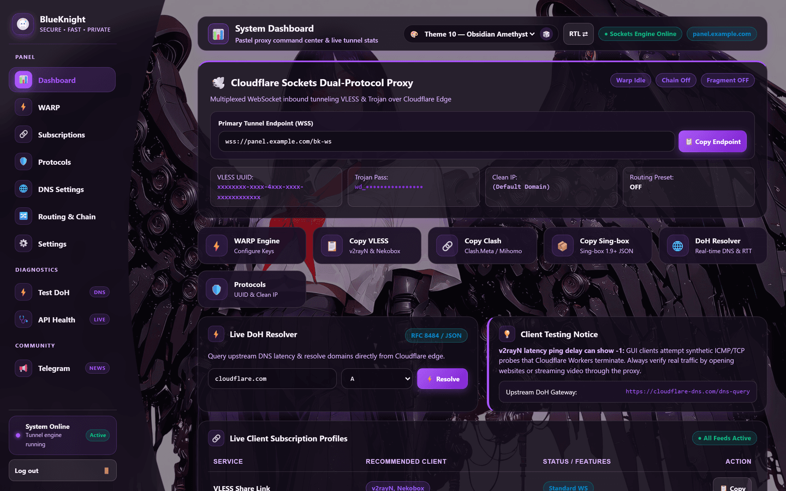
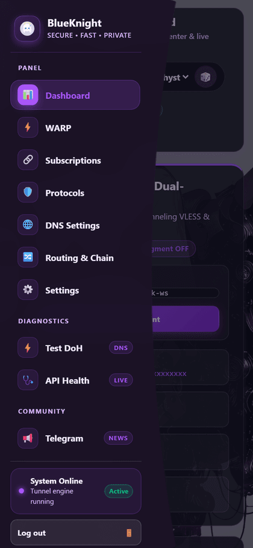

<div align="center">

# 🛡️ NiniPanel Panel

**Your own proxy panel, encrypted DNS and subscription server — from one file, in about three minutes.**

Free to run on Cloudflare. No server, no domain, no Linux knowledge required.

<br>

[](https://github.com/NiniPanelNet/Nini-Panel-Panel/releases/latest)
[](#-license)
[](https://t.me/sedef3345)

<br>

[**⚡ Install in 3 minutes**](#-install-in-3-minutes) ·
[**📱 Connect your phone**](#-connect-your-phone-or-pc) ·
[**🌍 Other hosts**](#-dont-want-cloudflare) ·
[**❓ Problems**](#-if-something-doesnt-work) ·
[**💬 Telegram**](https://t.me/sedef3345)

<br>



</div>

<br>

## What you get

| | |
| :--- | :--- |
| 🔌 **Working protocols** | VLESS, Trojan and Shadowsocks over WebSocket, plus TLS fragmentation and chain proxying for difficult networks |
| 📱 **One link for every client** | v2rayNG, Hiddify, Clash, sing-box, Streisand, NekoBox — paste one subscription URL and it keeps itself up to date |
| 📡 **Encrypted DNS** | A private DoH resolver, with live latency for each upstream shown in the panel |
| 🎨 **Ten themes** | Own wallpaper and palette each; works down to a 320px phone screen |
| ☁️ **Runs anywhere** | Cloudflare, Vercel, Netlify, Fly.io, Railway, Render, Koyeb, Docker, or your own VPS |

<br>

---

## ⚡ Install in 3 minutes

The easiest way is Cloudflare Workers — free, and you only copy and paste.

### 1 · Download the file

Go to the [**Releases page**](https://github.com/NiniPanelNet/Nini-Panel-Panel/releases/latest)
and download **`worker-standalone.js`**. That single file is the whole panel —
wallpapers and all. Open it in a text editor and copy everything (Ctrl+A, Ctrl+C).

### 2 · Create the worker

1. Sign in at [dash.cloudflare.com](https://dash.cloudflare.com) — a free account is enough
2. **Workers & Pages** → **Create** → **Start from Hello World** → **Deploy**
3. **Edit code** → select all the sample code → paste yours over it → **Deploy**

### 3 · Give it somewhere to store your settings

Still in Cloudflare:

1. **Storage & Databases → KV → Create a namespace**, name it anything (e.g. `nini`)
2. Back in your worker: **Settings → Bindings → Add → KV namespace**
3. Variable name: **`BK_KV`** — exactly this — then pick the namespace you made
4. **Settings → Runtime**: set the compatibility date to `2024-09-23` or later and enable the **`nodejs_compat`** flag
5. **Deploy** once more

> [!IMPORTANT]
> Step 3 is not optional. Without `BK_KV` the panel has nowhere to keep your
> password, so it will refuse to log you in.

### 4 · Open your panel

```
https://<your-worker-name>.workers.dev/panel
```

It asks you to create an admin password on the first visit. **Choose a long
one** — this page is reachable from the whole internet.

<br>

---

## 📱 Connect your phone or PC


<br>

1. Log in to your panel and open the **Subscriptions** tab
2. Copy the link for the app you use — the panel builds each one for you:

| Your app | Copy this link |
| :--- | :--- |
| v2rayNG, Streisand, NekoBox, V2Box | **vless** or **trojan** |
| Hiddify, sing-box | **singbox** or **all** |
| Clash Meta / Clash Verge / FlClash | **clash** |
| Shadowsocks clients | **ss** |
| WARP / Amnezia clients | **warp** or **amnezia** |
| OpenVPN | **openvpn** |

3. In your client: **add subscription → paste the URL → update**
4. Connect.

Whenever you change something in the panel, hit *update* in your client — the
link rebuilds itself, so you never re-enter a config by hand.

> Each subscription link contains a secret token. Anyone holding the link can
> use your panel, so share it only with people you trust. If one leaks, rotate
> the token in **Settings** and the old link stops working immediately.

<br>

### Using the DNS side

Your panel is also an encrypted-DNS (DoH) server. Point any device or browser at:

```
https://<your-worker-name>.workers.dev/dns-query
```

The **DNS** tab lets you choose which upstream resolver it forwards to, and shows
the real latency of each.

<br>

---

## 🌍 Don't want Cloudflare?

The panel runs in ten other places. Download the project `.zip` from the
[Releases page](https://github.com/NiniPanelNet/Nini-Panel-Panel/releases/latest),
unzip it, and run the picker — it asks where you want to deploy and does the rest:

```bash
npm install
npm run deploy
```

On Windows you can just double-click **`NiniPanel-Deploy.cmd`** for the same menu.

| Where | Proxy tunnels | Free tier | What it needs |
| :--- | :---: | :---: | :--- |
| **Cloudflare Workers** | ✅ | ✅ | Recommended. The `BK_KV` binding |
| **Cloudflare Pages** | ✅ | ✅ | Same binding, set on the Pages project |
| **Fly.io** | ✅ | limited | A volume, so settings survive restarts |
| **Railway** | ✅ | trial | A volume |
| **Render** | ✅ | ✅ | A disk |
| **Vercel** | ✅ | ✅ | *Fluid compute* on, plus a KV / Upstash store |
| **Koyeb** | ✅ | ✅ | No disk available — add an Upstash Redis store |
| **Netlify** | ❌ | ✅ | Panel + DNS only; it cannot hold tunnels open |
| **Docker / your own VPS** | ✅ | — | A folder to keep data in (below) |
| **Your own PC** | ✅ | — | `npm start` → http://localhost:8080/panel |

<details>
<summary><b>🐳 Running it on your own server with Docker</b></summary>

<br>

```bash
docker build -t ninipanel .

docker run -d --name nini \
  -p 8080:8080 \
  -v /srv/nini/data:/app/data \
  -e PANEL_PASSWORD='a strong password' \
  -e JWT_SECRET="$(openssl rand -hex 32)" \
  ninipanel
```

The `-v` line is what keeps your settings between restarts — back that folder up.
Put the panel behind HTTPS (a reverse proxy, or Cloudflare in front); over plain
HTTP the login cookie cannot be marked secure.

</details>

<details>
<summary><b>🔧 Building a full VPN server (sing-box + OpenVPN)</b></summary>

<br>

If you have your own domain and a TLS certificate, the panel can generate a
complete native VPN stack with matching client profiles:

```bash
node deploy.mjs native --host=vpn.example.com \
  --protocols=shadowtls,shadowsocks,hysteria2,tuic,anytls,openvpn \
  --cert=cert.pem --key=key.pem
```

</details>

Per-provider detail, update steps and verification live in
**[DEPLOYMENT.md](DEPLOYMENT.md)**.

<br>

---

## 🎨 Themes

<div align="center">

</div>

<br>

Ten themes, each with its own wallpaper and accent colour. The picker — and a
dice button, if you would rather be surprised — sits in the panel header. The
whole layout folds down to a phone screen with a slide-out menu.

<br>

---

## ❓ If something doesn't work

| What you see | What it means |
| :--- | :--- |
| **Login bounces back, or "cannot sign you in"** | The `BK_KV` binding is missing or misspelled — it must be exactly `BK_KV`. On non-Cloudflare hosts, set a `JWT_SECRET` instead |
| **Panel loads but the theme is a flat colour** | You pasted the `worker.js` from the source tree instead of `worker-standalone.js` from Releases. Use the release file |
| **You have to set a password again after a while** | Your host has no persistent storage attached — add the KV binding, the volume, or the Redis store for that platform |
| **Clients connect but nothing loads (Netlify)** | Netlify cannot carry proxy tunnels. Host the tunnel elsewhere and use Netlify for the panel only |
| **A subscription link returns 404** | Copy it from the Subscriptions tab again — the token changed, usually because storage was reset |
| **An error mentioning imports or `nodejs_compat`** | Enable the `nodejs_compat` flag and set the compatibility date to `2024-09-23` or later |

Still stuck? Ask on **[@sedef3345](https://t.me/sedef3345)**.

<br>

---

## 🔒 Keeping it safe

- **Use a long admin password.** The login page has no rate limit, so password
  strength is what protects you. If the panel is public, add a Cloudflare WAF
  rate-limit rule on `/panel/login`.
- **Treat subscription links like passwords.** Rotate the token in Settings if
  one leaks.
- **Keep it behind HTTPS.** Cloudflare and the managed hosts do this for you; a
  bare VPS does not.

Your password is stored hashed (PBKDF2-SHA256, 100,000 iterations, salted per
record) — never in the clear. Coming from an older release, it migrates itself
the first time you log in.

<br>

---

## 🔗 Links

- 💬 **[@sedef3345 on Telegram](https://t.me/sedef3345)** — releases, help and news
- 📘 **[Deployment guide](DEPLOYMENT.md)** — every platform in detail
- 🧪 **[Connection notes](CONNECTION-AUDIT.md)** — protocol and transport coverage, for the curious

<br>

## 📄 License

MIT

<br>

<div align="center">
<sub>Built for people who need the open internet. · <a href="https://t.me/sedef3345">@sedef3345</a></sub>
</div>
## DNS and regional-access controls

The DNS tab includes Fake IP, multiple resolver transports, DNS routing, domain policies and gateway fallbacks for full Mihomo, Sing-box and Xray JSON profiles, plus TUN settings for Mihomo/Sing-box. See [DNS and regional-access tools](docs/DNS-AND-REGION.md) for setup, client compatibility and verification limits.
